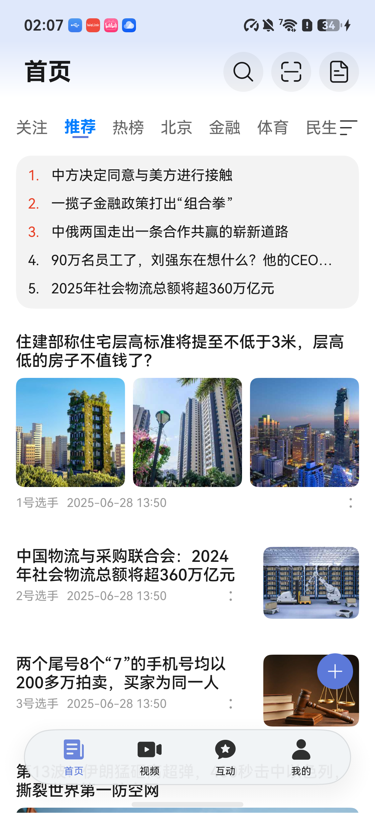
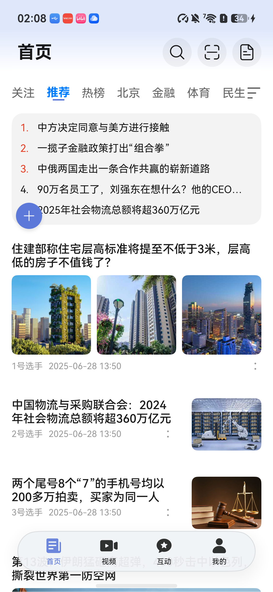
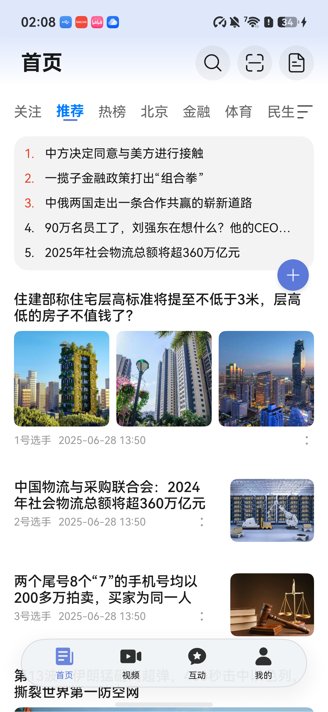

# 智感握姿接入汇总报告

工程：D:\HW\testproject\osfeaturetest\ComprehensiveNew0928

## 智感握姿改造汇总

以下为已实施的代码配置；实际效果以逐项验证结果为准。

| 改造项 | 页面 / 组件 | 已实施配置 | 修改文件 | 运行验证 | 视觉验证 |
|---|---|---|---|---|---|
| 首页悬浮发表按钮接入智感握姿：随握持手左右换侧（贴边绕屏外转场、等高等边距），保留纵向拖拽、去除横向拖拽、不新增按钮 | products/phone IndexPage 首页Tab（business&#95;home HomePage） / FloatingPublishBtn 悬浮发表按钮 | 悬浮球随握持手左右换侧：贴边绕屏外转场、等高等边距；保留纵向拖拽，去除横向拖拽，不新增按钮 | features/business&#95;home/src/main/ets/components/FloatingPublishBtn.ets products/phone/src/main/ets/pages/IndexPage.ets commons/lib&#95;common/src/main/ets/models/TabModel.ets products/phone/src/main/module.json5 products/phone/src/main/resources/base/element/string.json features/business&#95;home/src/main/module.json5 features/business&#95;home/src/main/resources/base/element/string.json | 通过 | 通过 |

## 路线与模式

| 目标 | 技术路线 | 类别 |
|---|---|---|
| 首页悬浮发表按钮接入智感握姿：随握持手左右换侧（贴边绕屏外转场、等高等边距），保留纵向拖拽、去除横向拖拽、不新增按钮 | holding-hand | smart-reach/holding-hand 原组件位移 |

## 视觉验证结果

### 首页悬浮发表按钮接入智感握姿：随握持手左右换侧（贴边绕屏外转场、等高等边距），保留纵向拖拽、去除横向拖拽、不新增按钮

页面 / 组件：products/phone IndexPage 首页Tab（business&#95;home HomePage） / FloatingPublishBtn 悬浮发表按钮。

视觉结果：**通过**。真机（华为畅享 90 Pro Max，API26）实测：基线悬浮球右侧贴边（组件树 bounds x=936..1080，右边距48px=16vp pagePadding）；开发者左手握持后球换至左侧（x=48..192，左边距48px，左右边距完全对称即等边距）；纵向拖拽后高度随手指变化（top 1955→828）而水平侧不变；右手握持后换回右侧（top≈881 等高保持）。换侧动画弧线观感由开发者现场目视确认无异常。限制说明：AI 已尝试读取截图但当前执行模型不支持图片输入，几何结论由同时刻组件树 bounds 支撑，截图已按场景存档供人工复核。

设备：华为畅享 90 Pro Max；系统：API 26 (Release)。

验证时间：2026-10-08T06:05:46.020Z；整体结果：未确认。

| 验证阶段 | 结果 | 说明 |
|---|---|---|
| 静态检查 | 通过 | 静态检查通过，warn 项已全部复核 |
| SDK | 通过 | 本机 SDK API 26，holding-hand 路线可用 |
| 构建 | 通过 | ohpm、Hvigor 同步与打包通过 |
| 安装启动 | 通过 | 应用已安装并启动 |
| 目标页导航 | 通过 | 导航完成，目标页面断言通过 |
| 运行观察 | 通过 | 运行日志无 motion 订阅失败记录（无 201/801/31500001/31500002），DETECT&#95;GESTURE 授权后订阅成功并持续回调：左手→LEFT&#95;HAND&#95;HELD 换左、右手→RIGHT&#95;HAND&#95;HELD 换右、双手/未握持保持当前侧（前一同逻辑版本实测，本轮未重复）；拖拽期间换侧方向暂存、松手后应用（左手拖拽后停左侧）；纵向拖拽正常且修复了列表跟随滚动问题（移除 band 的 HitTestMode.Transparent 后开发者确认列表不跟动）；横向拖拽已去除，球始终贴边。未覆盖：换侧动画进行中同时拖拽的极端并发、系统设置内关闭智感握姿开关后的 801 路径。 |

静态复核结论：

- 已复核通过：核对 reason 资源可解析且用途准确，usedScene.abilities 属于实际使用能力的模块 Ability，页面可见期感知使用 inuse；位置：features/business&#95;home/src/main/module.json5；reason 资源 $string:gesture&#95;reason 已在 features/business&#95;home/src/main/resources/base/element/string.json 定义且用途准确；HAR 声明随构建合并进承载 HAP（products/phone），已解包 phone-default-unsigned.hap 核对 module.json 合并结果，usedScene.abilities=PhoneAbility 与 entry 模块 mainElement 一致，when=inuse 对应页面可见期感知。
- 已复核通过：发现同名回调退订候选；核对回调归属、订阅标志、API/SysCap 守卫和失败处理；位置：features/business&#95;home/src/main/ets/components/FloatingPublishBtn.ets:133、features/business&#95;home/src/main/ets/components/FloatingPublishBtn.ets:147；on/off 使用同一稳定回调实例 this.handleHoldingHandChange（组件字段初始化一次）；subscribed 标志先判后置避免重复 on；订阅前 canIUse 守卫；off 失败保留标志并记录，不清标志后重复订阅；aboutToDisappear 清理路径不受可见条件阻止。
- 已复核通过：核对 SysCap、201/801/服务异常、停止后迟到回调与原路径恢复；不能靠关键字证明分支有效；位置：features/business&#95;home/src/main/ets/components/FloatingPublishBtn.ets:133；motion.on/off 均在 try/catch 内，201/801/31500001/31500002 仅记录日志并保留原路径（悬浮球右侧初始贴边+纵向拖拽+发表业务不变）；回调先经 isSenseActive 校验，页面隐藏/切Tab/后台后的迟到回调被忽略；运行时行为待真机复核。
- 已复核通过：对照基线验证关闭/不支持/低版本回退，未知状态不强制换边，交互期间不移位，功能和状态保持；位置：features/business&#95;home/src/main/ets/components/FloatingPublishBtn.ets:133；基线保留：初值右侧贴边（原布局）、断点尺寸48/68、纵向拖拽clamp、onClick登录校验与路由均不变；NOT&#95;HELD/双手/UNKNOWN&#95;STATUS=16保持当前侧不触发换边动画；按压/拖拽期间暂存pendingSide、交互结束且增强有效才应用；隐藏/后台清空待应用方向。

截图场景：baseline-right-side。

截图场景：vertical-drag-result。

截图场景：right-hand-after-drag。

## 升级与兼容

SDK 版本与回退行为按整个工程记录一份；保留行为覆盖所有改造项。

| 项目 | 改造前 | 改造后 |
|---|---|---|
| 本机 SDK API | 26 | 26 |
| compile API | 23 | 26 |
| target API | 24 | 24 |
| 最低兼容 API | 23 | 23 |

SDK/API 变更如上表。

| 回退条件 | 保留行为 | 验证结果 | 证据或限制 |
|---|---|---|---|
| 低版本 | 首页悬浮发表按钮接入智感握姿：随握持手左右换侧（贴边绕屏外转场、等高等边距），保留纵向拖拽、去除横向拖拽、不新增按钮：工程 compatibleSdkVersion 23 &#62;= 路线 minApi 20，无低版本分支；运行时 canIUse 守卫不满足时不进入新接口路径，悬浮球保持原右侧布局与完整业务功能 | 通过 | 首页悬浮发表按钮接入智感握姿：随握持手左右换侧（贴边绕屏外转场、等高等边距），保留纵向拖拽、去除横向拖拽、不新增按钮：build-profile.json5 compatibleSdkVersion 6.1.0(23)；holding-hand 路线 minApi=20；SDK 根清单 sdk-pkg.json API 26 |
| 设备不支持 | 首页悬浮发表按钮接入智感握姿：随握持手左右换侧（贴边绕屏外转场、等高等边距），保留纵向拖拽、去除横向拖拽、不新增按钮：canIUse 不满足或订阅返回 201/801/31500001/31500002 时：不置订阅标志、仅记录日志，悬浮球保持初始右侧贴边、纵向拖拽与发表业务不变（待真机复核） | 未验证 | 尚未实际验证 |
| 特性关闭 | 首页悬浮发表按钮接入智感握姿：随握持手左右换侧（贴边绕屏外转场、等高等边距），保留纵向拖拽、去除横向拖拽、不新增按钮：NOT&#95;HELD/双手/UNKNOWN&#95;STATUS=16 保持当前侧；页面隐藏、切Tab、后台时停止感知并清空待应用方向，恢复可见后恢复监听；无系统关闭查询接口，不以无回调推断关闭（待真机复核） | 未验证 | 尚未实际验证 |
